# pands-project
# Fisher Iris Data Set
# Author: Regina Fennessy

# Introduction
The Fisher Data set was first introduced by Ronald Fisher in 1936. Ronald is a british statistician and biologist.

This dataset is one of the most used data sets.

It is made up of 50 data sets from 3 different species of the Iris flower. 
This was used to quantify the variations of the three species.

        Iris Setosa                   Iris Vericolour              Iris Virginica                
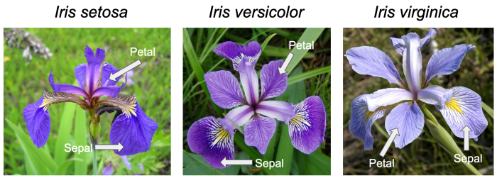

Four types of measurements were used from each flower. 

1. Sepal length in cm
2. Sepal width in cm
3. Petal length in cm
4. Petal width in cm

He created a linear discriminant model which was used to tell the three species apart.

# Libraries Used for this Project:

1. NumPy: Numpy or Numerical Python was created in 2005 by Travis Oliphant. Is a fundamental package for scientific computing with Python. It is used for working in domain of linear alegbra fourier and matrices
2. Pandas: Is an open source library used for data analysis/data science and machine learning tasks in python. It is built on top of Numpy which provides support for multi -dimensional arrays
3. Seaborn: Is a data visualisation library based on matplotlib. It provides a high level interface for drawing attractive and informative statistical graphics
4. Matplotlib: Is a python library for creating static or interactive visualisations

# Summary of the Data set:

1. Count: Shows the total quantity of data points in the dataset.
2. Mean: Shows the average by the 4 different datasets.
3. Std/standard deviation: Shows how much variation there is in the data set. In the below table the petal lenght has the most deviation between the 4 variables.
4. Min: Shows the lowest value in the dataset
5. 25%: Shows the value that 25% of the data collected lie below that value
6. 50%: Is where half the data lie below the median and half lie above the median
7. 75%: Shows the value that 75% of the data collected lie above that value
8. Max: Shows the highest value in the dataset

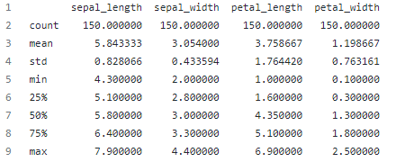

# Histograms:

The below graph displays the Histogram of the Petal Lengths off all 3 classes of Iris plant. 
The graph illustrates the range of Length from 1 to 7cms and the majority approx. 66% of the measurements lie between the ranges of 2.7 to 6.8 cms. 
An observation can be made that there are 2 distinct datasets with this histogram for Petal Length.

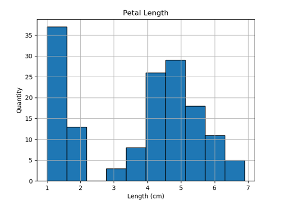

The below graph displays the Histogram of the Petal Widths from all 3 classes of Iris plant. The graph illustrates the range of width from 0.1 to 2.5cms and the majority approx.. 66% of the measurements lie between the ranges of 0.75 to 2.5 cms. An observation can be made that there are 2 distinct datasets with this histogram for Petal Width.

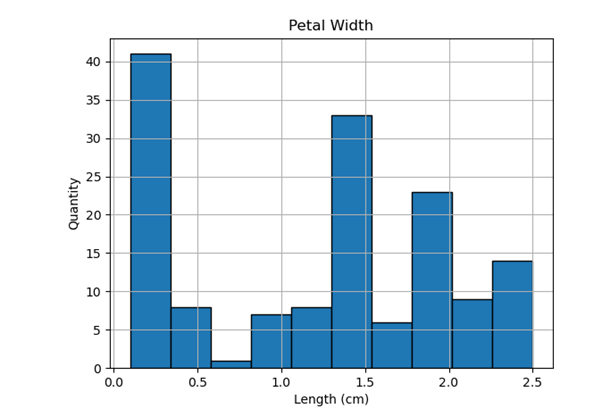

The below graph displays the Histogram of the Sepal Lengths off all 3 classes of Iris plant. The graph illustrates the range of Length from 4.3 to 7.9cms. The sepal length range within these three classes of flower is narrower in comparison to the previous histograms of Petal Length and Width.

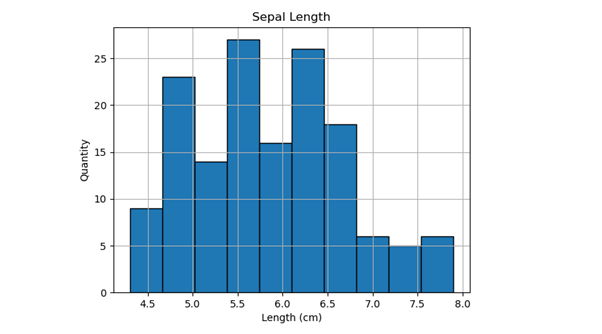

The below graph displays the Histogram of the Sepal Widths from all 3 classes of Iris plant. The graph illustrates the range of width from 2 to 4. 4cms. These measurements across all 3 classes of Iris show very normal spread for width as majority of measurements are within a width of 2.5 to 3.4cms.

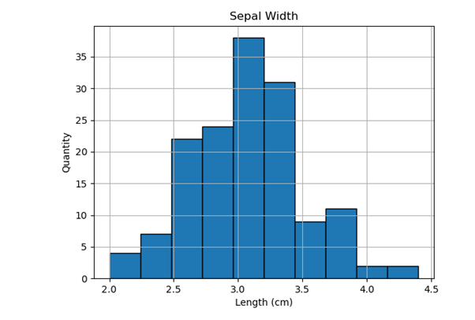

# Scatterplots:

The below scatterplot analysis shows the comparison of two data sets Sepal Width and Sepal Length and to compare these across the three Iris classes to see if there is any relationship between them. From this visual analysis of data it is clear that there are two distinct relationships between Sepal Width and Length between one set (Setosa) and the second set (Versicolor & Virginica).

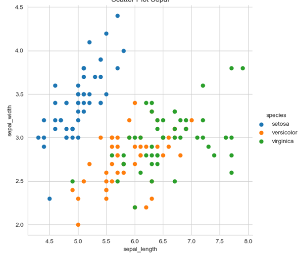

The below scatterplot analysis shows the comparison of two data sets Petal Width and Petal Length and to compare these across the three Iris classes to see if there is any relationship between them. From this visual analysis of data it is clear that there is a strong linear relationship across all classes of plant for petal length and width, when the values of the petal length increase so does the values of the petal width. From the distribution of this data it shows three claases of plant with different petal sizes as plants from the Setosa can be easily distinguished from the other two (versicolor & virginina).

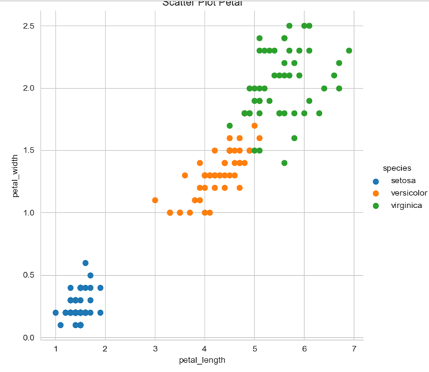

The below scatterplot analysis shows the comparison of two data sets Sepal Length and Petal Length and to compare these across the three Iris classes to see if there is any relationship between them. From this visual analysis of data it is clear that there is a strong linear relationship across all classes of plant for Sepal Length and Petal Length, when the values of the Sepal Length increase so does the values of the petal length. From the distribution of this data it shows three classes of plant with different Sepal lengths as plants from the Setosa can be easily distinguished from the other two (versicolor & virginina).

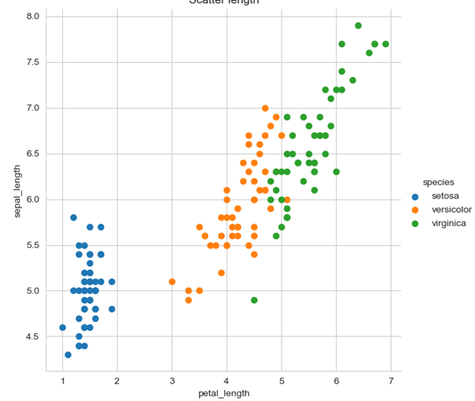

The below scatterplot analysis shows the comparison of two data sets Sepal Width and Petal Width and to compare these across the three Iris classes to see if there is any relationship between them. From this visual analysis of data it does not show a strong relationship between the independent variable (petal width) and the dependent variable Sepal Width. There are three independent groups however there is some slight overlap between the versicolor and virginica classes of plant.

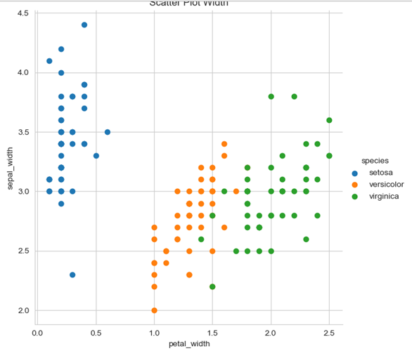

# Boxplot:

This box plot also known as a box and whisker plot displays the summary of the four data sets of the Iris Classes. These box plots show the whiskers on the outside from Min to Max with the line in the centre as the median and the box from the first quartile to the third quartile. This visualization of data shows that the data for petal length has a larger range of measurements for the three Iris plants and the sepal width has a smaller range of measurements which tells us that there is little difference between the Sepal widths on the three Iris plants. The Sepal width is also displaying some outliers outside of the boxplot analysis which highlights that these values are distant from the rest of the data.

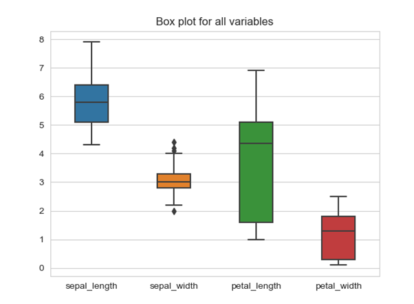

# Reference:

1. What is NumPy. https://www.w3schools.com/python/numpy/numpy_intro.asp

2. What is Pandas. https://pandas.pydata.org/

3. What is Seaborn. https://seaborn.pydata.org/

4. What is matplotlib. https://matplotlib.org/

5. Backround on data set. https://en.wikipedia.org/wiki/Iris_flower_data_set

6. How to add images in Visual Studio Code. https://marketplace.visualstudio.com/items?itemName=mushan.vscode-paste-image

7. Reading/Writing to txt files. https://www.pythontutorial.net/python-basics/python-read-text-file/

8. Summary on a dataset. https://www.geeksforgeeks.org/python-basics-of-pandas-using-iris-dataset/

9. Creating historgrams/boxplots. https://www.geeksforgeeks.org/box-plot-and-histogram-exploration-on-iris-data/

10. Creating scatterplot. https://www.geeksforgeeks.org/plotting-graph-for-iris-dataset-using-seaborn-and-matplotlib/

